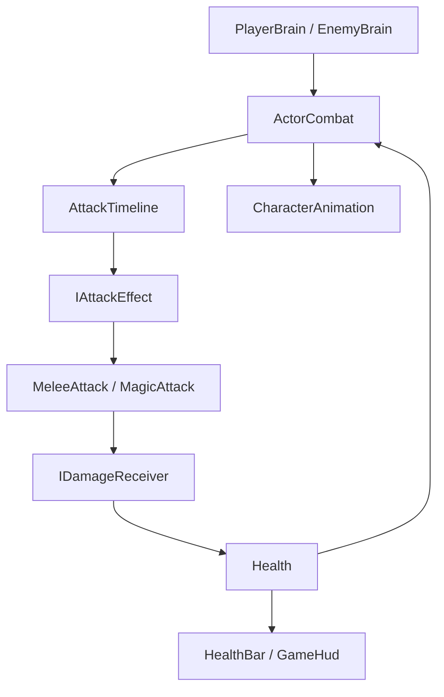

# Архитектура лабы 1–2

## Три сборки

| Сборка | Содержимое | Зависимости |
|---|---|---|
| `Lab12.Domain` | `Health`, `Damage`, контракты, таймлайн атаки, правило выбора поведения врага | Только C#; `noEngineReferences: true` |
| `Lab12.Runtime` | Адаптеры Unity, движение, физика, Animator, UI, фабрики, сборка зависимостей сцены | Domain, Unity, Input System, AI Navigation, uGUI |
| `Lab12.Editor` | Создание сцены, клипов, контроллера, импорт внешности монстров и валидатор | Runtime, Domain и Unity Editor; исключена из билда |

Тесты выделены в сборки EditMode и PlayMode.

## Создание игры

`SceneBootstrapper.Awake` проверяет ссылки, строит NavMesh, создаёт собственный набор Input Actions, фабрику снарядов, фабрику интерфейса и фабрику персонажей. Затем создаёт героя, передаёт ссылку на него врагам и размещает по 2–3 врага каждого типа.

Обычные классы получают зависимости через конструкторы. Для компонентов Unity используются явные методы `Initialize`. Они вызываются сразу после `AddComponent`, до первого `Update`. У новых компонентов нет `Awake`, читающего ещё не переданные зависимости. Нет поиска игрока по тегу, глобального статического `PlayerDied`, Service Locator и DI-контейнера.

`CharacterDefinition` — ScriptableObject с настройками. Текущее HP, кулдауны и прогресс атаки принадлежат конкретному экземпляру персонажа; общие настройки не используются для хранения текущего состояния.

## Как проходит атака

1. `PlayerBrain` получает клик через `IPlayerInput`, а `EnemyBrain` решает атаковать по дистанции и видимости.
2. Оба вызывают один и тот же `ActorCombat.TryAttack`.
3. Он проверяет смерть, стан, выполняющуюся атаку и кулдаун. Запускает нужное состояние анимации и `AttackTimeline`.
4. В момент попадания таймлайн один раз вызывает `IAttackEffect.Execute`.
5. `MeleeAttack` проверяет радиус, сектор перед персонажем, команду цели, препятствия и повторяющиеся коллайдеры. `MagicAttack` создаёт снаряд.
6. Получатель вызывается через `IDamageReceiver`. `Combatant` фильтрует союзный урон и передаёт его модели `Health`.
7. `Health` публикует факты изменения HP, получения несмертельного урона или смерти. UI и анимация реагируют отдельно.

`Physical` и `Magical` сохранены в данных урона. Разные сопротивления не добавлены: ТЗ их не требует. Различаются значение урона и способ доставки — удар вблизи либо снаряд.

## Анимация

У доступной Sorceress используется собственный контроллер. В нём один слой и пять состояний:

| Состояние | Motion | Управление |
|---|---|---|
| Locomotion | Blend Tree: Idle / Walk / Run | `Speed`, фактическая скорость движения |
| Melee | Копия `Attack1` | Явный `CrossFadeInFixedTime` |
| Magic | Копия `RangeAttack1` | Явный `CrossFadeInFixedTime` |
| Hit | Копия `LightHit` | Прерывает текущую атаку |
| Death | Копия `Death` | Без возврата в Locomotion |

Параметр `ActionSpeed` подгоняет длительность Melee/Magic/Hit под настройку действия. Поэтому реакция LightHit занимает 0,35 с, даже если исходный клип длиннее. Смерть проигрывается с исходной скоростью.

Отдельный булевый флаг для каждого действия и общий `TriggerNumber` не нужны. Визуальный адаптер знает имена состояний; модель HP и таймлайн атаки не знают Animator. Анимации не управляют HP через вызов старых методов `Shoot` и других событий ассета.

Движение выполняют CharacterController/NavMeshAgent. Root motion отключён. Ходьба и бег зациклены; удар, выстрел, реакция и смерть — нет. После завершения атаки/реакции `ActorCombat` возвращает представление в Locomotion. При смертельном попадании сразу выбирается Death, без промежуточного Hit. Враг удаляется с задержкой, чтобы смерть успела проиграться.

Новая копия клипа не меняет исходный FBX. Отдельная совместимость с исходными монстрами сохраняет их контроллер, но очищает Animation Events через AnimatorOverrideController. Наличие и семантика исходных переходов требуют проверки после возврата Resources.

## Принципы из лекций

| Принцип | Конкретное применение |
|---|---|
| SRP | `Health` хранит здоровье; `AttackTimeline` ведёт время атаки; `PlayerMotor` перемещает; `CharacterAnimation` отображает; `HealthBar` обновляет полосу |
| OCP | Другой эффект атаки реализует `IAttackEffect`; таймлайн не меняется |
| LSP | Игрок и враг получают урон по одному контракту; нет наследования, меняющего смысл здоровья для одного типа |
| ISP | UI получает `IReadOnlyHealth`; атаке достаточно `IDamageReceiver`; представление и ввод имеют отдельные контракты |
| DIP | Контракты HP и атаки объявлены в Domain. Domain не зависит от Unity. Таймлайн получает эффект извне, UI работает через интерфейс здоровья |
| DRY | Общие HP, выполнение атаки, доставка урона, интерфейс полосы и создание актёров используются игроком и обоими врагами |
| KISS | Одна игровая сцена, ручная передача зависимостей, обычные события C#, без глобальной шины событий и контейнера ради небольшой лабы |

Опора на приложенные материалы: лекция 1 — модульность и направление зависимостей; лекция 2 — SOLID/DRY/KISS; лекция 3 — Bootstrapper, DI через конструктор/метод и границы MonoBehaviour; лекция 6 — фабрика и конфигурации ScriptableObject; лекция 7 — Observer для HP. Использование этих приёмов не означает реализацию заданий последующих лабораторных. Сохранения/MVC-меню из следующего раздела, босс и расширенная машина состояний сюда не включены.

## Поведение и физика

- Ближний враг замечает игрока в пределах 10 м, преследует и атакует в пределах `Melee Reach`.
- Дальний враг атакует в диапазоне 5–10 м, отходит при дистанции меньше 5 м. При отходе проверяет несколько достижимых направлений: это помогает у стен, но не заменяет сложный тактический AI. За пределами радиуса обнаружения враг переходит в покой.
- За препятствием враг пытается приблизиться по NavMesh. Удар через стену запрещён отдельной проверкой, даже если дистанция мала.
- Для снарядов используется SphereCast по всему отрезку перемещения за кадр, а не только проверка точки в конце кадра. Начальное пересечение проверяется отдельно. Из нескольких столкновений выбирается ближайшее допустимое.
- Коллайдеры мира находятся на слое 8 (`LabWorld`), актёров — на слое 9 (`LabActors`). Камера учитывает только мир; NavMesh строится только по миру. Новые препятствия нужно помещать под объект World и назначать им LabWorld.
- Спавн ограничен картой, проверяет NavMesh, достижимость героя, расстояние до него, препятствия и соседних врагов.

В источнике уже были две реализации AI и большое наследование StateMachine. Они оставлены для сравнения в исходных папках, но новая сцена использует только новый модуль. Расширенный AI с боссом и мирным режимом относится к следующим работам.
